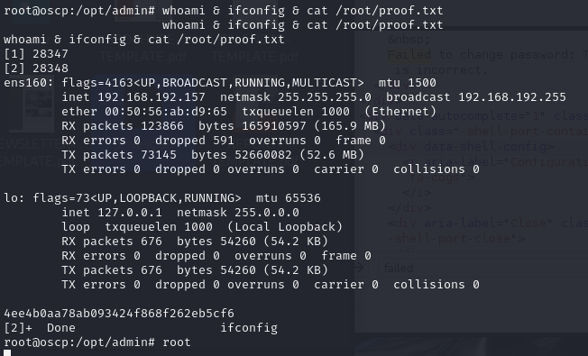

# 1 
- frankfurt
- common name = oscp.example.com
## Nmap scan
```
Host is up (0.043s latency).
Not shown: 63416 closed tcp ports (reset), 2103 filtered tcp ports (no-response)
Some closed ports may be reported as filtered due to --defeat-rst-ratelimit
PORT     STATE SERVICE  VERSION
21/tcp   open  ftp      vsftpd 3.0.3
| ssl-cert: Subject: commonName=oscp.example.com/organizationName=Vesta Control Panel/stateOrProvinceName=California/countryName=US
| Not valid before: 2022-11-08T08:16:51
|_Not valid after:  2023-11-08T08:16:51
|_ssl-date: TLS randomness does not represent time
22/tcp   open  ssh      OpenSSH 7.6p1 Ubuntu 4ubuntu0.7 (Ubuntu Linux; protocol 2.0)
| ssh-hostkey: 
|   2048 7e:62:fd:92:52:6f:64:b1:34:48:8d:1e:52:f1:74:c6 (RSA)
|   256 1b:f7:0c:c7:1b:05:12:a9:c5:c5:78:b7:2a:54:d2:83 (ECDSA)
|_  256 ee:d4:a1:1a:07:b4:9f:d9:e5:2d:f6:b8:8d:dd:bf:d7 (ED25519)
25/tcp   open  smtp     Exim smtpd 4.90_1
| ssl-cert: Subject: commonName=oscp.example.com/organizationName=Vesta Control Panel/stateOrProvinceName=California/countryName=US
| Not valid before: 2022-11-08T08:16:51
|_Not valid after:  2023-11-08T08:16:51
| smtp-commands: oscp.exam Hello nmap.scanme.org [192.168.251.233], SIZE 52428800, 8BITMIME, PIPELINING, AUTH PLAIN LOGIN, CHUNKING, STARTTLS, HELP
|_ Commands supported: AUTH STARTTLS HELO EHLO MAIL RCPT DATA BDAT NOOP QUIT RSET HELP
|_ssl-date: 2024-09-29T03:22:11+00:00; +1m23s from scanner time.
53/tcp   open  domain   ISC BIND 9.11.3-1ubuntu1.18 (Ubuntu Linux)
| dns-nsid: 
|_  bind.version: 9.11.3-1ubuntu1.18-Ubuntu
80/tcp   open  http     nginx
|_http-title: oscp.exam &mdash; Coming Soon
| http-methods: 
|_  Potentially risky methods: TRACE
110/tcp  open  pop3     Dovecot pop3d
|_ssl-date: TLS randomness does not represent time
|_pop3-capabilities: RESP-CODES SASL(PLAIN LOGIN) CAPA STLS UIDL TOP USER PIPELINING AUTH-RESP-CODE
| ssl-cert: Subject: commonName=oscp.example.com/organizationName=Vesta Control Panel/stateOrProvinceName=California/countryName=US
| Not valid before: 2022-11-08T08:16:51
|_Not valid after:  2023-11-08T08:16:51
143/tcp  open  imap     Dovecot imapd (Ubuntu)
| ssl-cert: Subject: commonName=oscp.example.com/organizationName=Vesta Control Panel/stateOrProvinceName=California/countryName=US
| Not valid before: 2022-11-08T08:16:51
|_Not valid after:  2023-11-08T08:16:51
|_imap-capabilities: OK LITERAL+ listed IDLE AUTH=PLAIN capabilities STARTTLS IMAP4rev1 ID post-login Pre-login ENABLE SASL-IR have AUTH=LOGINA0001 LOGIN-REFERRALS more
|_ssl-date: TLS randomness does not represent time
465/tcp  open  ssl/smtp Exim smtpd 4.90_1
|_ssl-date: 2024-09-29T03:20:23+00:00; -24s from scanner time.
| smtp-commands: oscp.exam Hello nmap.scanme.org [192.168.251.233], SIZE 52428800, 8BITMIME, PIPELINING, AUTH PLAIN LOGIN, CHUNKING, HELP
|_ Commands supported: AUTH HELO EHLO MAIL RCPT DATA BDAT NOOP QUIT RSET HELP
| ssl-cert: Subject: commonName=oscp.example.com/organizationName=Vesta Control Panel/stateOrProvinceName=California/countryName=US
| Not valid before: 2022-11-08T08:16:51
|_Not valid after:  2023-11-08T08:16:51
587/tcp  open  smtp     Exim smtpd 4.90_1
| ssl-cert: Subject: commonName=oscp.example.com/organizationName=Vesta Control Panel/stateOrProvinceName=California/countryName=US
| Not valid before: 2022-11-08T08:16:51
|_Not valid after:  2023-11-08T08:16:51
|_ssl-date: 2024-09-29T03:21:12+00:00; +24s from scanner time.
| smtp-commands: oscp.exam Hello nmap.scanme.org [192.168.251.233], SIZE 52428800, 8BITMIME, PIPELINING, AUTH PLAIN LOGIN, CHUNKING, STARTTLS, HELP
|_ Commands supported: AUTH STARTTLS HELO EHLO MAIL RCPT DATA BDAT NOOP QUIT RSET HELP
993/tcp  open  ssl/imap Dovecot imapd (Ubuntu)
| ssl-cert: Subject: commonName=oscp.example.com/organizationName=Vesta Control Panel/stateOrProvinceName=California/countryName=US
| Not valid before: 2022-11-08T08:16:51
|_Not valid after:  2023-11-08T08:16:51
|_imap-capabilities: OK more LITERAL+ listed post-login IDLE Pre-login AUTH=PLAIN SASL-IR have capabilities AUTH=LOGINA0001 IMAP4rev1 LOGIN-REFERRALS ENABLE ID
|_ssl-date: TLS randomness does not represent time
995/tcp  open  ssl/pop3 Dovecot pop3d
| ssl-cert: Subject: commonName=oscp.example.com/organizationName=Vesta Control Panel/stateOrProvinceName=California/countryName=US
| Not valid before: 2022-11-08T08:16:51
|_Not valid after:  2023-11-08T08:16:51
|_ssl-date: TLS randomness does not represent time
|_pop3-capabilities: UIDL TOP SASL(PLAIN LOGIN) CAPA USER RESP-CODES PIPELINING AUTH-RESP-CODE
2525/tcp open  smtp     Exim smtpd 4.90_1
| smtp-commands: oscp.exam Hello nmap.scanme.org [192.168.251.233], SIZE 52428800, 8BITMIME, PIPELINING, AUTH PLAIN LOGIN, CHUNKING, STARTTLS, HELP
|_ Commands supported: AUTH STARTTLS HELO EHLO MAIL RCPT DATA BDAT NOOP QUIT RSET HELP
|_ssl-date: 2024-09-29T03:20:34+00:00; -14s from scanner time.
| ssl-cert: Subject: commonName=oscp.example.com/organizationName=Vesta Control Panel/stateOrProvinceName=California/countryName=US
| Not valid before: 2022-11-08T08:16:51
|_Not valid after:  2023-11-08T08:16:51
3306/tcp open  mysql    MySQL 5.7.40-0ubuntu0.18.04.1
|_ssl-date: TLS randomness does not represent time
| ssl-cert: Subject: commonName=MySQL_Server_5.7.40_Auto_Generated_Server_Certificate
| Not valid before: 2022-11-08T08:15:37
|_Not valid after:  2032-11-05T08:15:37
| mysql-info: 
|   Protocol: 10
|   Version: 5.7.40-0ubuntu0.18.04.1
|   Thread ID: 7
|   Capabilities flags: 65535
|   Some Capabilities: IgnoreSigpipes, InteractiveClient, Speaks41ProtocolOld, SupportsTransactions, Speaks41ProtocolNew, LongPassword, ConnectWithDatabase, FoundRows, SupportsCompression, ODBCClient, SwitchToSSLAfterHandshake, Support41Auth, DontAllowDatabaseTableColumn, LongColumnFlag, SupportsLoadDataLocal, IgnoreSpaceBeforeParenthesis, SupportsMultipleStatments, SupportsAuthPlugins, SupportsMultipleResults
|   Status: Autocommit
|   Salt: xM\x10iX!9N\x016g\x0C)m\x0FY4D\x04^
|_  Auth Plugin Name: mysql_native_password
8080/tcp open  http     Apache httpd 2.4.29 ((Ubuntu) mod_fcgid/2.3.9 OpenSSL/1.1.1)
|_http-server-header: Apache/2.4.29 (Ubuntu) mod_fcgid/2.3.9 OpenSSL/1.1.1
|_http-open-proxy: Proxy might be redirecting requests
| http-methods: 
|_  Potentially risky methods: TRACE
|_http-title: oscp.exam &mdash; Coming Soon
8083/tcp open  http     nginx
|_http-title: Did not follow redirect to https://192.168.233.156:8083/
8443/tcp open  http     Apache httpd 2.4.29 ((Ubuntu) mod_fcgid/2.3.9 OpenSSL/1.1.1)
|_http-title: Apache2 Ubuntu Default Page: It works
| http-methods: 
|_  Potentially risky methods: TRACE
|_http-server-header: Apache/2.4.29 (Ubuntu) mod_fcgid/2.3.9 OpenSSL/1.1.1
Service Info: Host: oscp.exam; OSs: Unix, Linux; CPE: cpe:/o:linux:linux_kernel

Host script results:
|_clock-skew: mean: 17s, deviation: 48s, median: -14s
```
## Service Emumeration

### ftp
- vsftpd 3.0.3
- no anonymous login
### ssh 
- no cred yet
- OpenSSH 7.6p1 Ubuntu 4ubuntu0.7
### smtp 
- oscp.example.com/organizationName=Vesta Control Panel/stateOrProvinceName=California/countryName=US
### dns
- n/a
### 80:http
- roundcube
- ```/webmail```
### pop3 
- dovecot
### imap 
- dovecot
### 161:snmp
- jack@oscp
- password : 3PUKsX98BMupBiCf

### 465:ssl/smtp 
- exim smtpd 4.90_1
### 587:smtp
- exim smtpd 4.90_1
### 993:imap
- dovecot
### 995:ssl/pop3
- dovecot
### 2525:smtp
- exim smtpd 4.90_1
- 4.91 - Local Privilege Escalation
### 3306:mysql
- 5.7.40 mysql (?)
### 8080:http
- roundcube
- ```/webmail```
### 8083:https
- vestacp
### 8443:http
- roundcube
- ```/webmail```


## Exploit
1. try to login 8083 as Jack:3PUKsX98BMupBiCf
2. success and find RCE about vesta CP : https://ssd-disclosure.com/ssd-advisory-vestacp-multiple-vulnerabilities/
3. run the exploit
## Post Exploitation
- N/A
## Privilege Esculation
- N/A (only need upgrade the shell since its a webshell)
## Proofs


# 2
- charlie
## Nmap scan
```
PORT      STATE SERVICE VERSION
21/tcp    open  ftp     vsftpd 3.0.5
| ftp-anon: Anonymous FTP login allowed (FTP code 230)
|_drwxr-xr-x    2 114      120          4096 Nov 02  2022 backup
| ftp-syst: 
|   STAT: 
| FTP server status:
|      Connected to ::ffff:192.168.251.192
|      Logged in as ftp
|      TYPE: ASCII
|      No session bandwidth limit
|      Session timeout in seconds is 300
|      Control connection is plain text
|      Data connections will be plain text
|      At session startup, client count was 3
|      vsFTPd 3.0.5 - secure, fast, stable
|_End of status
22/tcp    open  ssh     OpenSSH 8.9p1 Ubuntu 3 (Ubuntu Linux; protocol 2.0)
| ssh-hostkey: 
|   256 0e:ad:d7:de:60:2b:49:ef:42:3b:1e:76:9c:77:33:85 (ECDSA)
|_  256 99:b5:48:fb:77:df:18:b0:1d:ad:e0:92:f3:e1:26:0d (ED25519)
80/tcp    open  http    Apache httpd 2.4.52 ((Ubuntu))
|_http-server-header: Apache/2.4.52 (Ubuntu)
|_http-title: Apache2 Ubuntu Default Page: It works
20000/tcp open  http    MiniServ 1.820 (Webmin httpd)
|_http-title: Site doesn't have a title (text/html; Charset=utf-8).
|_http-server-header: MiniServ/1.820
Service Info: OSs: Unix, Linux; CPE: cpe:/o:linux:linux_kernel
```
## Service Emumeration
### ftp
- support anonymous
- found pdfs -> get author names (Robert, Mark, Cassie)
- try brute force username: password
- found cassie:cassie
### ssh
- cannot ssh
### 80:http
- nothing
### 20000:http
- usermin 1.820
- vuln to unauthN rce

## Exploit
1. ``` get 50234.py ```
2. ``` python3 50234.py -u 192.168.192.157 -l cassie -p cassie ``` Get local shell
## Post Exploitation
- found that root is running cron job : ``` */2 * * * * root cd /opt/admin && tar -zxf /tmp/backup.tar.gz * ``` every 2minutes
## Privilege Esculation
- leverage wildcard tar : poison with checkpoint and add sudoer sh 
## Proofs
- 

# 3
- pascha 
## Nmap scan
```
PORT      STATE SERVICE    VERSION
80/tcp    open  http       Microsoft IIS httpd 10.0
| http-methods: 
|_  Potentially risky methods: TRACE
|_http-title: IIS Windows
7680/tcp  open  pando-pub?
9099/tcp  open  unknown
| fingerprint-strings: 
|   FourOhFourRequest, GetRequest: 
|     HTTP/1.0 200 OK 
|     Server: Mobile Mouse Server 
|     Content-Type: text/html 
|     Content-Length: 321
|_    <HTML><HEAD><TITLE>Success!</TITLE><meta name="viewport" content="width=device-width,user-scalable=no" /></HEAD><BODY BGCOLOR=#000000><br><br><p style="font:12pt arial,geneva,sans-serif; text-align:center; color:green; font-weight:bold;" >The server running on "OSCP" was able to receive your request.</p></BODY></HTML>
9999/tcp  open  abyss?
35913/tcp open  unknown
1 service unrecognized despite returning data. If you know the service/version, please submit the following fingerprint at https://nmap.org/cgi-bin/submit.cgi?new-service :
SF-Port9099-TCP:V=7.94SVN%I=7%D=10/1%Time=66FBC864%P=x86_64-pc-linux-gnu%r
SF:(GetRequest,1A2,"HTTP/1\.0\x20200\x20OK\x20\r\nServer:\x20Mobile\x20Mou
SF:se\x20Server\x20\r\nContent-Type:\x20text/html\x20\r\nContent-Length:\x
SF:20321\r\n\r\n<HTML><HEAD><TITLE>Success!</TITLE><meta\x20name=\"viewpor
SF:t\"\x20content=\"width=device-width,user-scalable=no\"\x20/></HEAD><BOD
SF:Y\x20BGCOLOR=#000000><br><br><p\x20style=\"font:12pt\x20arial,geneva,sa
SF:ns-serif;\x20text-align:center;\x20color:green;\x20font-weight:bold;\"\
SF:x20>The\x20server\x20running\x20on\x20\"OSCP\"\x20was\x20able\x20to\x20
SF:receive\x20your\x20request\.</p></BODY></HTML>\r\n")%r(FourOhFourReques
SF:t,1A2,"HTTP/1\.0\x20200\x20OK\x20\r\nServer:\x20Mobile\x20Mouse\x20Serv
SF:er\x20\r\nContent-Type:\x20text/html\x20\r\nContent-Length:\x20321\r\n\
SF:r\n<HTML><HEAD><TITLE>Success!</TITLE><meta\x20name=\"viewport\"\x20con
SF:tent=\"width=device-width,user-scalable=no\"\x20/></HEAD><BODY\x20BGCOL
SF:OR=#000000><br><br><p\x20style=\"font:12pt\x20arial,geneva,sans-serif;\
SF:x20text-align:center;\x20color:green;\x20font-weight:bold;\"\x20>The\x2
SF:0server\x20running\x20on\x20\"OSCP\"\x20was\x20able\x20to\x20receive\x2
SF:0your\x20request\.</p></BODY></HTML>\r\n");
Service Info: OS: Windows; CPE: cpe:/o:microsoft:windows
```
## Service Emumeration
### http
- gobusted enum -> nothing intesting
### 7680:tcp
- nothing interesting
### 9099 Mobile Mouse Server
- found RCE exploit edb:51010
### 9999:tcp
- nothing interesting
### 35913:tcp
- nothing interesting
## Exploit
- msfconsole runing exploit(windows/misc/mobile_mouse_rce) module
## Post Exploitation
1. Found MilleGPG5 5.9.2 (Gennaio 2023) - Local Privilege Escalation / Incorrect Access Control exploit
## Privilege Esculation
1. Finding which service is set by system: ``` Get-CimInstance -ClassName win32_service | Select Name,State,PathName ```
2. replaced GPGService.exe to rev_shell.exe
3. ``` Restart-Service GPGOrchestrator ```
## Proofs
- 