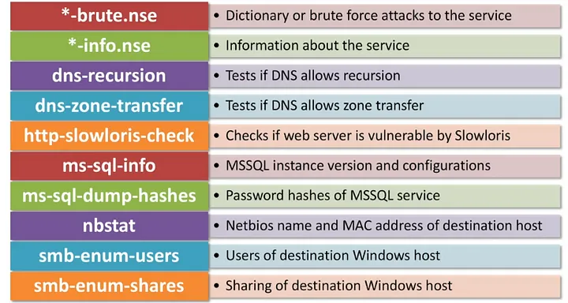

# Nessus
## Not allowed to use LOL

# Nmap
## Allow Use~
## NSE Vulnerability Scripts Scanning
- Browse script   
``` cd /usr/share/nmap/scripts/
cat script.db  | grep "\"vuln\""
```

- Scan for exploitable
```
sudo nmap -sV -p 443 --script "vuln" 192.168.50.124
```

## Work with NSE vuln

## Update db with new script
- Paste the new script to nmap/scripts
``` sudo nmap --script-updatedb ```

## Search nmap list 
``` locate *.nse ```

## Use
1. ``` sudo nmap 192.168.172.59 -p- -Pn -O -T5 -vvv``` (-n = no dns resolve)

2. ``` sudo nmap 192.168.172.59 -p22,53,80,5000 -sCVS --script vuln -vvv -T5 ```

- ``` sudo nmap 192.168.172.59 -p1-65535 -sUT -T5```

- ``` nmap -sCVS --script=smb-vuln-* {ip} -vvv ```

## OSCP
1. Advanced nmap ``` sudo nmap -Pn -n $IP -sC -sV -p- --open ``` (remove --open to get filtered) 
2. Advanced nmap for udp ``` sudo nmap -sU --top-ports 100  {ip}```
3. Group of machines (tcp) : ``` sudo nmap -Pn -n -iL {internal_machines.txt} -sC -sV -p- --open ```